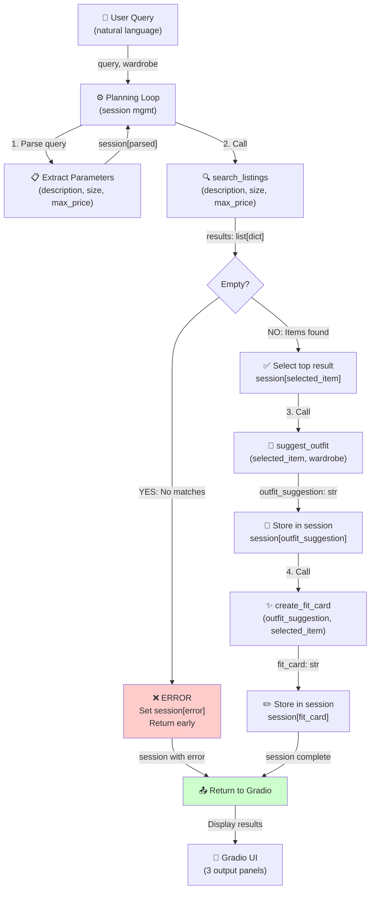

# FitFindr — planning.md

> Complete this document before writing any implementation code.
> Your spec and agent diagram are what you'll use to direct AI tools (Claude, Copilot, etc.) to generate your implementation — the more specific they are, the more useful the generated code will be.
> Your planning.md will be reviewed as part of your submission.
> Update it before starting any stretch features.

---

## Overview

FitFindr helps users find secondhand fashion pieces and figure out how to style them with what they already own. You describe what you're looking for (like "vintage graphic tee under $30"), the agent searches a dataset of 40 thrifted items, picks the best match, and then uses your wardrobe to suggest outfit combinations. It also generates a casual caption you can post to Instagram. If nothing matches your search, it tells you what to try instead instead of crashing. If you don't have any wardrobe entered yet, it still gives you styling suggestions — just more general ones.

---

## Tools

List every tool your agent will use. For each tool, fill in all four fields.
You must have at least 3 tools. The three required tools are listed — add any additional tools below them.

### Tool 1: search_listings

**What it does:**
Searches the 40 secondhand listings by matching keywords in the description, and filters by optional size and price constraints. Returns a sorted list of matching items ranked by relevance (best matches first).

**Input parameters:**

- `description` (str): Keywords the user is searching for (e.g., "vintage graphic tee", "platform sneakers"). Can include style tags or item types.
- `size` (str or None): Optional size filter. Matches case-insensitively and handles ranges (e.g., "M", "S/M", "XL"). If None, skip size filtering.
- `max_price` (float or None): Optional maximum price (inclusive). If None, skip price filtering.

**What it returns:**
A list of matching listing dictionaries, each containing: `id`, `title`, `description`, `category`, `style_tags` (list), `size`, `condition`, `price` (float), `colors` (list), `brand`, `platform`. List is sorted by keyword relevance (highest score first). Returns empty list `[]` if no matches.

**What happens if it fails or returns nothing:**
If the list is empty, the agent stops and returns an error message to the user: "Sorry, no listings matched your search. Try different keywords, a larger size range, or a higher budget." No further tools are called.

---

### Tool 2: suggest_outfit

**What it does:**
Takes a thrifted item and the user's existing wardrobe, then generates 1–2 outfit suggestions combining the new item with pieces from the wardrobe. Uses an LLM to reason about color, style, and vibe.

**Input parameters:**

- `new_item` (dict): A listing dict containing: `id`, `title`, `description`, `category`, `style_tags`, `size`, `condition`, `price`, `colors`, `brand`, `platform`.
- `wardrobe` (dict): A wardrobe dict with an `items` key containing a list of wardrobe item dicts. Each wardrobe item has: `id`, `name`, `category`, `colors` (list), `style_tags` (list), `notes` (optional). May be empty (`items: []`).

**What it returns:**
A non-empty string (2–4 sentences) describing outfit combinations. If wardrobe is empty, return general styling suggestions (e.g., "This piece pairs well with earth tones and oversized bottoms. It's perfect for a casual grunge vibe"). If wardrobe is populated, suggest specific outfits using actual wardrobe piece names.

**What happens if it fails or returns nothing:**
If the wardrobe is empty, the tool still returns useful output - just general styling advice instead of specific piece combinations. The agent proceeds normally with this advice.

---

### Tool 3: create_fit_card

**What it does:**
Generates a short, casual Instagram/TikTok caption for the outfit. The caption should sound authentic (like a real person posting an OOTD), mention the item name and price and platform naturally (once each), and capture the outfit vibe in specific terms.

**Input parameters:**

- `outfit` (str): The outfit suggestion string from `suggest_outfit()` (2–4 sentences describing the styling).
- `new_item` (dict): The listing dict containing: `title`, `price`, `platform`, `description`, `style_tags`, `colors`.

**What it returns:**
A 2-4 sentence string in casual tone suitable for posting. Should include: item name, price, platform (depop/thredUp/poshmark), and a description of the vibe. Example: "scored this vintage graphic tee on depop for $24 the faded graphic hits different. baggy jeans + chunky sneakers + denim jacket = full grunge mode"

**What happens if it fails or returns nothing:**
If the outfit string is empty or missing, return an error string: "Unable to generate a fit card - outfit suggestion was incomplete." The agent returns this error instead of crashing, but does not proceed to display the fit card.

---

### Additional Tools (if any)

<!-- Copy the block above for any tools beyond the required three -->

---

## Planning Loop

**How does your agent decide which tool to call next?**

1. **Initialize**: Create a new session dict with empty/None values for all results fields.

2. **Parse the query**: Use an LLM or regex to extract three parameters from the user's natural language query:
   - `description`: keywords for what they're looking for
   - `size`: optional size (e.g., "M", "S/M"). If not mentioned, set to None.
   - `max_price`: optional max price (e.g., $30). If not mentioned, set to None.
     Store these in `session["parsed"]`.

3. **Search**: Call `search_listings(description, size, max_price)` and store the result in `session["search_results"]`.

4. **Check for results**:
   - If `search_results` is empty, set `session["error"]` to the error message and **return the session early** (do not proceed).
   - If results exist, continue.

5. **Select top item**: Set `session["selected_item"] = session["search_results"][0]` (pick the best match).

6. **Suggest outfit**: Call `suggest_outfit(session["selected_item"], session["wardrobe"])` and store the result in `session["outfit_suggestion"]`.

7. **Create fit card**: Call `create_fit_card(session["outfit_suggestion"], session["selected_item"])` and store the result in `session["fit_card"]`.

8. **Return**: Return the completed session dict. The calling code (Gradio handler) checks `session["error"]` to decide what to display.

---

## State Management

**How does information from one tool get passed to the next?**

All state is stored in a single `session` dict that persists for the entire user interaction. Here's what gets tracked:

- `session["query"]`: The original user query (unchanged).
- `session["parsed"]`: Dict with extracted parameters (`description`, `size`, `max_price`).
- `session["search_results"]`: List of matching listings returned by `search_listings()`.
- `session["selected_item"]`: The top listing (dict) selected from search results.
- `session["wardrobe"]`: The user's wardrobe dict (passed in at the start, unchanged).
- `session["outfit_suggestion"]`: String returned by `suggest_outfit()`.
- `session["fit_card"]`: String returned by `create_fit_card()`.
- `session["error"]`: Set to an error message if the interaction fails early; otherwise None.

At each step, the planning loop reads from prior steps and writes to the current step. For example:

- After `search_listings()`, the loop reads `session["search_results"]` to check if it's empty.
- When calling `suggest_outfit()`, it passes `session["selected_item"]` and `session["wardrobe"]` (already stored).
- When calling `create_fit_card()`, it passes `session["outfit_suggestion"]` and `session["selected_item"]`.

This way, each tool only needs to return its immediate output — the session dict handles threading state forward.

---

## Error Handling

For each tool, describe the specific failure mode you're handling and what the agent does in response.

| Tool            | Failure mode                     | Agent response                                                                                                                                                                                                  |
| --------------- | -------------------------------- | --------------------------------------------------------------------------------------------------------------------------------------------------------------------------------------------------------------- |
| search_listings | No results match the query       | "Sorry, no listings matched your search. Try different keywords, a larger size range, or a higher budget." Set `session["error"]` to this message and return the session early. No further tools are called.    |
| suggest_outfit  | Wardrobe is empty                | Tool still returns a string (general styling advice instead of specific piece names). Agent proceeds normally and displays the general suggestions. No error is raised.                                         |
| create_fit_card | Outfit input is missing or empty | Return the error string: "Unable to generate a fit card — outfit suggestion was incomplete." Set `session["fit_card"]` to this error message. The message is still displayed to the user in the fit card panel. |

---

## Architecture

---

## AI Tool Plan

<!-- For each part of the implementation below, describe:
     - Which AI tool you plan to use (Claude, Copilot, ChatGPT, etc.)
     - What you'll give it as input (which sections of this planning.md, your agent diagram)
     - What you expect it to produce
     - How you'll verify the output matches your spec before moving on

     "I'll use AI to help me code" is not a plan.
     "I'll give Claude my Tool 1 spec (inputs, return value, failure mode) and ask it to implement
     search_listings() using load_listings() from the data loader — then test it against 3 queries
     before trusting it" is a plan. -->

**Milestone 3 — Individual tool implementations:**

**Tool 1: search_listings**

- **AI tool**: Claude Code (writes the implementation)
- **Input**: The Tool 1 spec section (what it does, input parameters, return value, failure mode) + note that it uses only `load_listings()` from data_loader
- **Expected output**: A Python function that loads all listings, filters by size (case-insensitive substring match) and max_price, scores remaining items by keyword overlap with description, drops items with score 0, sorts by score, and returns the list
- **Verification**:
  1. Read generated code to confirm it filters by all three parameters and doesn't crash on empty results
  2. Test with `search_listings("vintage graphic tee", size="M", max_price=30)` — should return 3–5 results, all under $30, with keywords in title/description/tags
  3. Test with impossible query `search_listings("designer ballgown", size="XXS", max_price=5)` — should return `[]`, not raise an error
  4. Test with `search_listings("vintage", size=None, max_price=None)` — should return all vintage items

**Tool 2: suggest_outfit**

- **AI tool**: Claude Code
- **Input**: The Tool 2 spec section + note that it calls `_get_groq_client()` and the Groq API (llama-3.3-70b-versatile model)
- **Expected output**: A Python function that checks if wardrobe is empty, builds a prompt with the item and wardrobe details, calls Groq, and returns the response string (never empty or None)
- **Verification**:
  1. Read code to confirm it handles empty wardrobe gracefully (returns general advice, not error)
  2. Test with example_wardrobe — should return 2–3 sentences mentioning specific pieces by name (e.g., "your baggy jeans", "your denim jacket")
  3. Test with empty_wardrobe — should return 2–3 sentences of general styling advice (e.g., "pairs well with earth tones")
  4. Confirm both return non-empty strings

**Tool 3: create_fit_card**

- **AI tool**: Claude Code
- **Input**: The Tool 3 spec section + note that it calls Groq with higher temperature for variety
- **Expected output**: A Python function that checks if outfit is empty, builds a prompt for a casual Instagram caption mentioning item name/price/platform, calls Groq with temperature 0.8, and returns the caption string
- **Verification**:
  1. Read code to confirm it includes temperature setting and prompt mentions item name, price, and platform
  2. Test with outfit + listing — should return 2–4 sentences mentioning price and platform naturally
  3. Test with empty outfit — should return error message string, not crash
  4. Call twice with same input — output should differ (due to higher temperature)

**Milestone 4 — Planning loop and state management:**

- **AI tool**: Claude Code
- **Input**: The Planning Loop section (8 clear steps) + State Management section + Architecture diagram
- **Expected output**: The `run_agent(query, wardrobe)` function that implements the loop exactly: (1) init session, (2) parse query with LLM, (3) call search_listings, (4) check empty → return error if yes, (5) select top item, (6) call suggest_outfit, (7) call create_fit_card, (8) return session
- **Verification**:
  1. Read code to confirm it follows the 8-step sequence in Planning Loop
  2. Test happy path: `run_agent("vintage graphic tee under $30, size M", example_wardrobe)` — should return session with error=None, all output fields populated
  3. Test no-results path: `run_agent("designer ballgown size XXS under $5", example_wardrobe)` — should return session with error set, fit_card=None
  4. Test empty wardrobe: same queries with `empty_wardrobe()` — should still complete and return outfit_suggestion and fit_card

---

## A Complete Interaction (Step by Step)

Write out what a full user interaction looks like from start to finish — tool call by tool call. Use a specific example query.

**Example user query:** "I'm looking for a vintage graphic tee under $30, size M. I mostly wear baggy jeans and chunky sneakers."

**Step 1: Parse and Search**
Agent pulls out the key stuff from the query: looking for a "vintage graphic tee", size M, max $30.
Calls `search_listings()` and gets back 3 matches:

- "Graphic Tee — 2003 Tour Bootleg Style" — $24, depop (top result)
- "Vintage Band Tee — Faded Grey" — $19, depop
- "Y2K Baby Tee — Butterfly Print" — $18, depop
  Picks the top one and saves it.

**Step 2: Suggest Outfit**
Calls `suggest_outfit()` with the graphic tee and your wardrobe (baggy jeans, tank top, grey sweatshirt, denim jacket, white sneakers, combat boots, etc.).
LLM comes back with: "Pair this with your baggy jeans and white chunky sneakers - peak 90s grunge. Throw your black denim jacket on top and belt it if you want to cinch the waist."

**Step 3: Create Fit Card**
Calls `create_fit_card()` with the outfit suggestion and the tee details.
LLM generates: "scored this vintage graphic tee on depop for $24 the faded graphic hits different. baggy jeans + chunky sneakers + denim jacket = full grunge mode"

**Final output to user:**
Gradio shows three panels:

- **Left (Top listing)**: Graphic Tee - $24 on depop, good condition, size L. Description and all the details.
- **Middle (Outfit idea)**: "Pair this with your baggy jeans and white chunky sneakers..."
- **Right (Your fit card)**: "scored this vintage graphic tee on depop for $24..."
